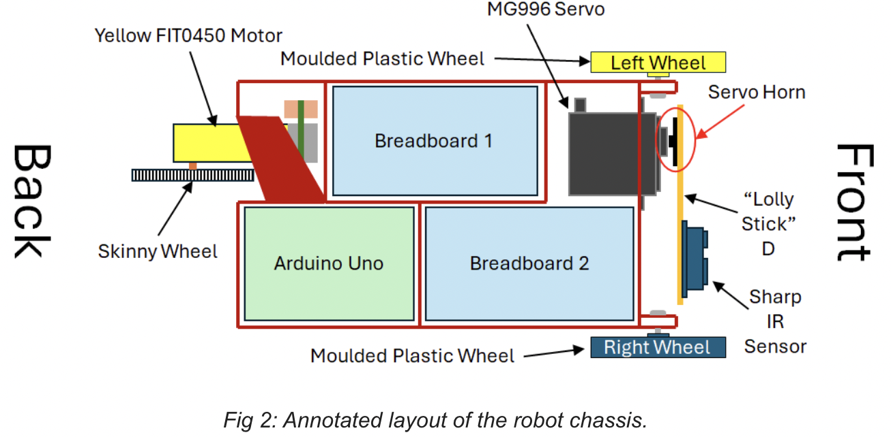
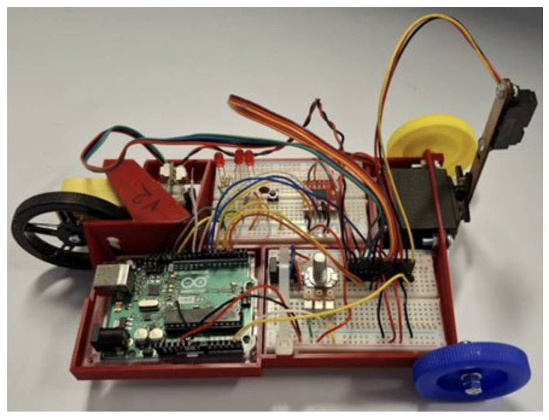
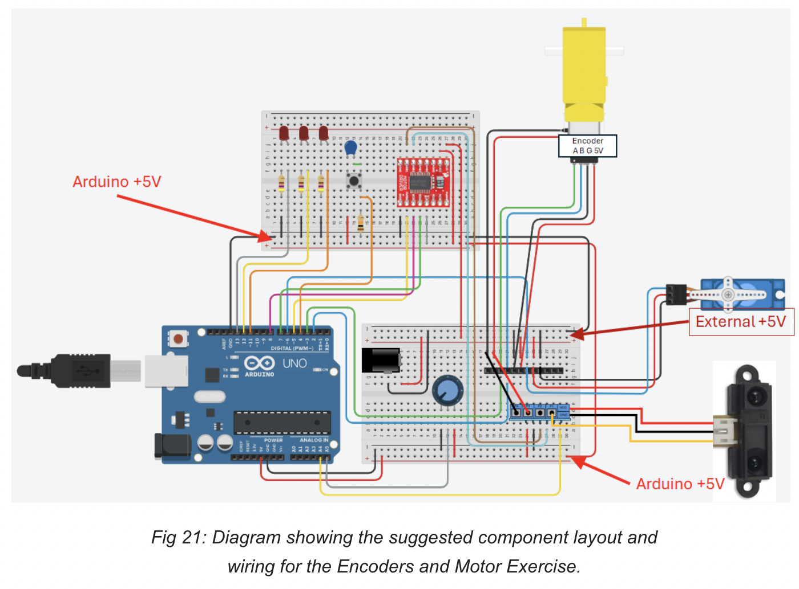

# Arduino Autonomous Robot – Encoder & IR PI Control

Designed and implemented a state-machine-driven autonomous robot integrating encoder-based position control and infrared distance tracking. Developed closed-loop PI controllers and structured embedded logic for multi-mode control operation.

---

## Key Features

- Quadrature encoder feedback using hardware interrupts
- Position-based PI motor control
- Infrared distance-based PI tracking control
- Finite state machine for sequential task execution
- 10 ms real-time control loop
- Servo actuation and LED status sequencing

---

## System Overview

This project integrates sensing, actuation, and feedback control into a structured embedded robotic system.

The robot performs the following sequence:

1. Waits for button input  
2. Actuates a servo-driven mechanism  
3. Executes a predefined motion profile:
   - Forward 15 cm  
   - Backward 30 cm  
   - Forward 30 cm  
   - Backward 15 cm  
4. Switches to infrared-based distance regulation for 20 seconds  
5. Stops and signals completion via LED  

---

## Control Architecture

### Position Control Mode

- Target distances converted to encoder counts  
- PI controller regulates motor position  
- Soft scaling near reference to reduce overshoot  
- Minimum PWM enforcement to prevent motor stall  

### IR Distance Tracking Mode

- Averaged IR sensor sampling  
- Nonlinear sensor-to-distance conversion  
- PI controller maintains ~30 cm reference distance  
- Automatic switching between control modes via state machine  

---

## Software Architecture

- Finite state machine governs system transitions  
- Interrupt-driven encoder counting  
- 10 ms fixed-period control loop  
- Mode switching between position and distance controllers  

---

## Hardware

- Arduino microcontroller  
- DC motor with quadrature encoder  
- Motor driver module  
- Infrared distance sensor  
- Servo motor  
- Push button and status LED  

---

## System Architecture

